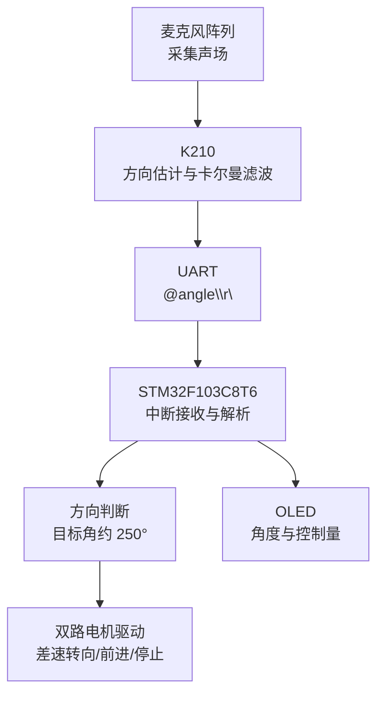

# 基于 K210 与 STM32 的声源追踪小车

> K210 麦克风阵列完成声源方向估计，STM32F103C8T6 接收角度并驱动差速小车转向，实现“感知—通信—决策—执行—显示”的嵌入式闭环。

## 项目简介

本项目将 K210 的音频阵列处理能力与 STM32 的实时控制能力结合：

- **K210 感知端**：读取麦克风阵列方向图，计算声源角度与强度，使用一维卡尔曼滤波抑制抖动；
- **串口通信**：以 9600 bit/s、8N1 格式发送 ASCII 数据帧；
- **STM32 控制端**：在 USART1 接收中断中解析角度，根据角度区间控制左右电机；
- **人机交互**：OLED 实时显示接收角度、速度和控制量。

该仓库保留了完整的 Keil 工程、STM32 标准外设库、K210 MaixPy 脚本以及项目配套文档，可直接用于学习异构双主控通信、声源方向估计和移动机器人执行控制。

## 功能特性

- K210 麦克风阵列声源方向估计
- 声源强度阈值判定，低强度时发送停止指令
- 对 `X / Y / 强度 / 角度` 分别进行卡尔曼滤波
- K210 与 STM32 串口通信
- STM32 USART1 中断接收与变长字符串帧解析
- 差速电机软件 PWM 与转向控制
- OLED 状态显示
- 工程中同时保留红外循迹、红外避障、超声波、蜂鸣器、测速和电池电压等底盘基础模块

## 系统架构



## 核心硬件

| 模块 | 作用 | 代码依据 |
|---|---|---|
| K210 开发板 | 声源方向计算、滤波、串口发送 | `K210_STM32(angle).py` |
| K210 兼容麦克风阵列 | 提供 `MIC_ARRAY` 声场图和方向数据 | `Maix.MIC_ARRAY` |
| STM32F103C8T6 | 串口接收、逻辑判断和底盘控制 | Keil 工程目标器件 |
| 双路直流电机驱动模块 | 驱动左右电机正反转 | PA6、PA7、PB0、PB1 |
| OLED 显示屏 | 显示角度、速度和控制量 | 软件 I²C：PB6、PB7 |
| 两路直流减速电机及小车底盘 | 完成旋转、前进和停止 | `motor.c` |

> 仓库没有记录具体 K210 板卡版本、电机驱动芯片型号和电源规格。接线前请以实际开发板和驱动板丝印为准，尤其不要依据本表猜测电机电源电压。

## 最小系统接线

### K210 与 STM32 串口

| K210 | STM32F103C8T6 | 说明 |
|---|---|---|
| IO30 / UART1_TX | PA10 / USART1_RX | K210 向 STM32 发送角度，必接 |
| IO31 / UART1_RX | PA9 / USART1_TX | 当前业务未使用，双向调试时可接 |
| GND | GND | 必须共地 |

串口参数：`9600 bit/s`、`8 data bits`、`no parity`、`1 stop bit`。

> 两端串口均应使用 **3.3 V TTL 电平**。不要将 RS-232 电平直接接入 MCU 引脚。

### STM32 与外设

| STM32 引脚 | 外设信号 | 方向 |
|---|---|---|
| PA7 | 左电机方向输入 1 | 输出 |
| PA6 | 左电机方向输入 2 | 输出 |
| PB1 | 右电机方向输入 1 | 输出 |
| PB0 | 右电机方向输入 2 | 输出 |
| PB7 | OLED SCL | 输出 |
| PB6 | OLED SDA | 双向/输出 |

完整引脚表和接线注意事项见 [硬件接线说明](docs/wiring.md)。

## 串口协议

K210 每 100 ms 计算一次结果。检测强度 `r > 15` 时发送角度，`r < 15` 时发送停止值：

```text
@250.37\r\n
@0\r\n
```

| 字段 | 含义 |
|---|---|
| `@` | 帧头，同时重置 STM32 接收索引 |
| `250.37` | ASCII 格式角度，单位为度 |
| `\r\n` | 帧尾；STM32 收到回车或换行后置位完整帧标志 |

当前 STM32 主循环使用 `atoi()` 解析，因此会忽略小数部分，例如 `250.37` 按 `250` 处理。协议细节见 [通信与代码说明](docs/code-walkthrough.md)。

## 快速开始

### 1. 准备软件

- K210：MaixPy IDE，以及支持 `Maix.MIC_ARRAY` 的固件；
- STM32：Keil MDK-ARM，安装 STM32F1 设备支持包；
- 下载器：ST-Link、J-Link 或工程所适配的其他下载器。

### 2. 运行 K210 程序

1. 按上表连接麦克风阵列、LCD 和串口；
2. 在 MaixPy IDE 中打开 `K210_STM32(angle).py`；
3. 确认开发板的 IO30、IO31 可映射为 UART1；
4. 连接开发板后运行脚本；
5. 在串口终端观察 `发送角度到STM32` 输出。

### 3. 编译并下载 STM32 程序

1. 使用 Keil 打开：
   `通信追踪2025.05.18/Project/Laasckp.uvprojx`
2. 确认目标器件为 `STM32F103C8`；
3. 编译工程并修正本机缺失的 Device Pack 或下载器设置；
4. 将程序烧录至 STM32；
5. 复位后观察 OLED 的 `angle`、`speed` 和 `data`。

### 4. 联调

1. 首次上电时让车轮离地，防止错误方向导致小车突然移动；
2. 确认 K210 与 STM32 共地；
3. 在声源较弱时，K210 应发送 `@0`，电机停止；
4. 改变声源方向，观察 OLED 角度变化和底盘转向；
5. 若左右方向相反，先核对电机接线与左右轮安装方向，再修改方向宏。

## 程序执行流程

1. K210 初始化 LCD、麦克风阵列、UART1 和四个卡尔曼滤波器；
2. 获取 12 个方向通道的阵列响应；
3. 将方向响应合成为平面向量，计算角度和强度；
4. 对计算结果滤波，强度满足阈值时发送角度；
5. STM32 USART1 中断逐字节接收数据，检测帧头和行结束符；
6. 主循环读取完整帧，解析角度并更新 OLED；
7. TIM2 每 10 μs 进入中断，生成软件 PWM，并依据角度控制底盘；
8. 声源落入目标方向区间时小车前进，否则原地调整方向。

详见 [执行流程说明](docs/execution-flow.md)。

## 仓库结构

```text
STM32_K210/
├── K210_STM32(angle).py        # K210 声源定位、滤波与串口发送
├── 通信追踪2025.05.18/
│   ├── User/main.c             # STM32 主循环与 OLED 数据展示
│   ├── Project/
│   │   ├── Laasckp.uvprojx     # Keil 工程入口
│   │   ├── uart2.c             # USART1 接收和帧解析
│   │   └── uart2.h
│   ├── Laasckp/
│   │   ├── interface.c/.h      # 总初始化与统一引脚定义
│   │   ├── motor.c/.h          # 电机软件 PWM 与运动接口
│   │   └── timer.c/.h          # TIM2 调度与声源追踪控制
│   ├── Library/                # STM32F10x 标准外设库
│   └── Startup/                # CMSIS、系统和启动文件
└── docs/                       # 原理、接线、流程和排错文档
```

## 核心代码导航

| 文件 | 重点内容 |
|---|---|
| `K210_STM32(angle).py` | 麦克风阵列、向量合成、卡尔曼滤波、强度阈值 |
| `User/main.c` | 完整帧处理、角度解析、OLED 显示 |
| `Project/uart2.c` | USART1 初始化和中断状态机 |
| `Laasckp/timer.c` | 10 μs 时基、软件 PWM、角度区间控制 |
| `Laasckp/motor.c` | 电机方向、刹车、停止与 `CarMove()` |
| `Laasckp/interface.h` | 硬件引脚与运动宏 |

## 当前控制策略

- 目标朝向区间：约 `240° ~ 265°`；
- 区间内：左右轮以较低占空比向前运动；
- 区间外：根据 `250° - received_angle` 的符号，以固定占空比旋转；
- 无有效声源：K210 发送 `0`，STM32 停止；
- `sound_PID()` 已在 `motor.c` 中实现，但当前追踪路径使用的是区间判断和固定转速，尚未接入 PID 闭环。

## 常见问题

| 现象 | 优先检查 |
|---|---|
| OLED 一直显示 0 | K210 TX 是否接 PA10、是否共地、波特率是否都是 9600 |
| STM32 收不到完整帧 | 是否包含 `@` 帧头和 `\r\n` 帧尾 |
| K210 提示 `MIC_ARRAY` 不存在 | MaixPy 固件是否支持对应麦克风阵列 API |
| 声源存在但发送 0 | `r > 15` 阈值是否适合现场音量与环境噪声 |
| 小车方向相反 | 左右电机接线、底盘安装方向和 `interface.h` 方向宏 |
| Keil 无法编译 | STM32F1 Device Pack、工程路径编码、编译器版本 |
| 角度只有整数 | STM32 当前使用 `atoi()`，需要小数时改用 `strtof()` |

更多排查步骤见 [故障排查指南](docs/troubleshooting.md)。

## 可继续优化

- 使用 `strtof()` 保留角度小数；
- 给串口协议增加长度、校验和与超时保护；
- 将 `sound_PID()` 接入定时控制环，并记录实际整定结果；
- 将角度阈值、强度阈值和速度配置集中为宏；
- 增加“超过一定时间未收到数据则强制停车”的失联保护；
- 使用真实实验数据评估角度误差、响应时间和稳态抖动。

## 安全说明

- 调试电机时先架空车轮；
- 电机电源与逻辑电源应按驱动板要求连接，并确保共地；
- 不要让电机电流直接流经 MCU 引脚；
- 修改中断控制逻辑后，应先低占空比测试；
- 本项目用于学习和原型验证，不应直接用于安全关键场景。

## License

仓库当前未声明开源许可证。默认情况下，代码版权归仓库作者所有；如需允许他人复制、修改和分发，请由作者选择并添加合适的 LICENSE。
