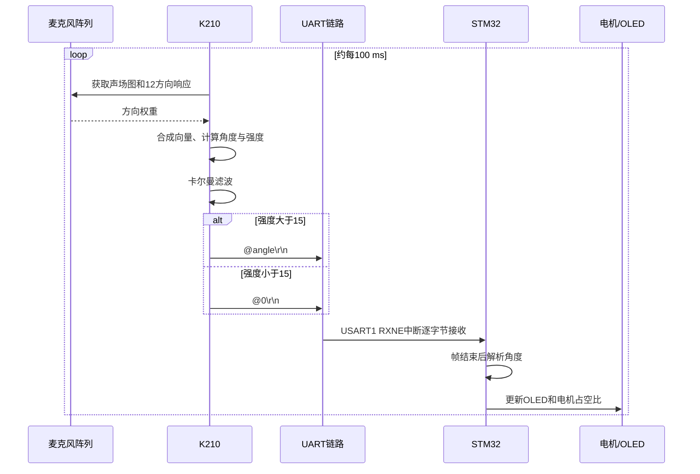
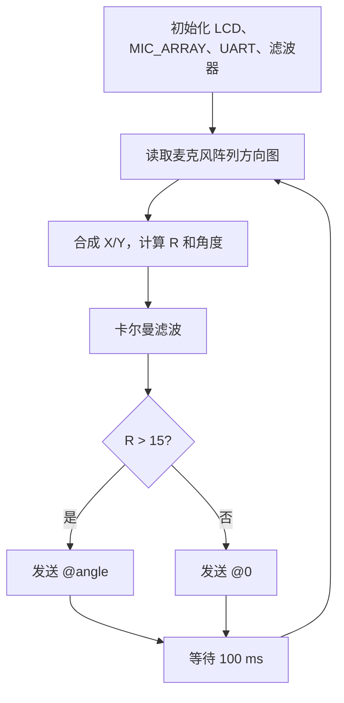
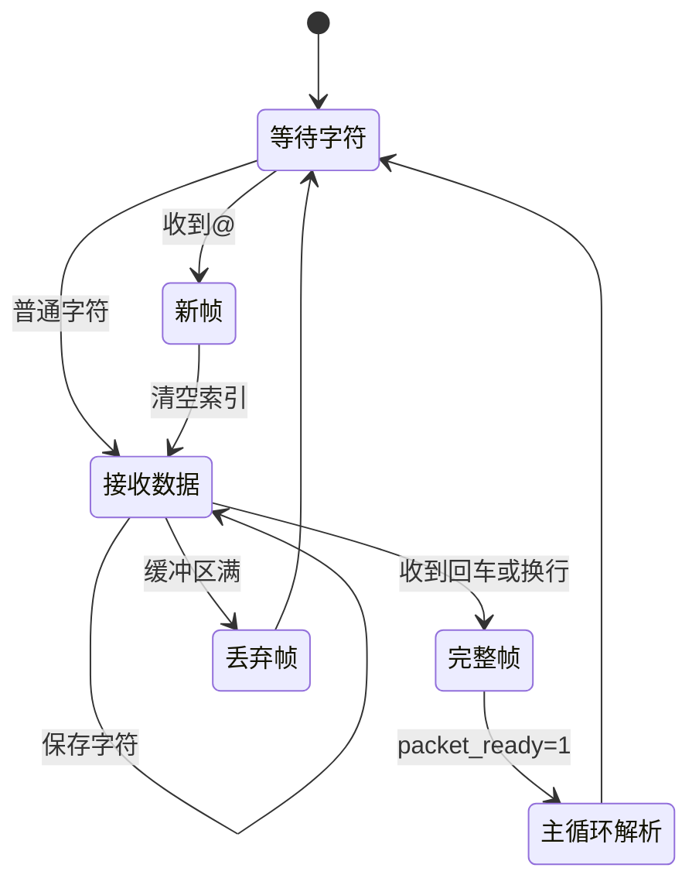
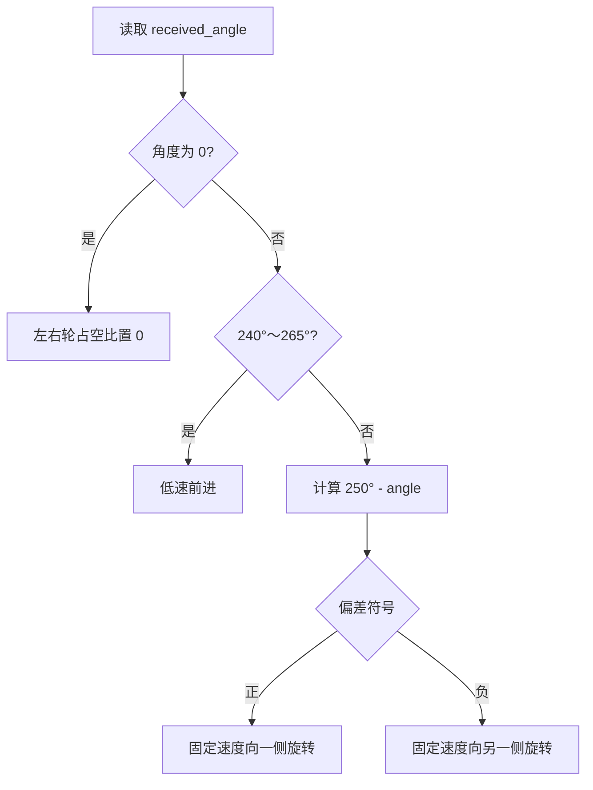

# 系统执行流程

## 1. 总体时序

## 2. K210 流程

边界说明：当前代码只处理 `R > 15` 和 `R < 15`，当 `R == 15` 时该轮不发送。

## 3. STM32 接收流程

## 4. 底盘决策流程

## 5. 中断与主循环分工

| 执行位置 | 任务 |
|---|---|
| K210 主循环 | 声场采集、方向计算、滤波、发送 |
| STM32 USART1 中断 | 接收字符、识别帧边界 |
| STM32 主循环 | 解析完整帧、更新 OLED |
| STM32 TIM2 中断 | 软件 PWM、声源方向控制、测速和舵机时基 |

这种设计能快速完成原型，但 TIM2 周期只有 10 μs，中断内工作较多。后续优化时可让中断只维护计数和 PWM，把声源决策放到 10～20 ms 的控制任务中。

## 6. 一次有效控制闭环

1. 声音到达麦克风阵列；
2. K210 获得各方向响应；
3. K210 计算并滤波角度；
4. K210 发送 ASCII 数据帧；
5. STM32 中断接收帧；
6. 主循环解析并更新共享角度；
7. 定时器中断根据角度更新左右轮占空比；
8. 底盘旋转或前进，改变阵列相对声源的朝向；
9. 下一帧角度再次进入控制判断，形成闭环。
