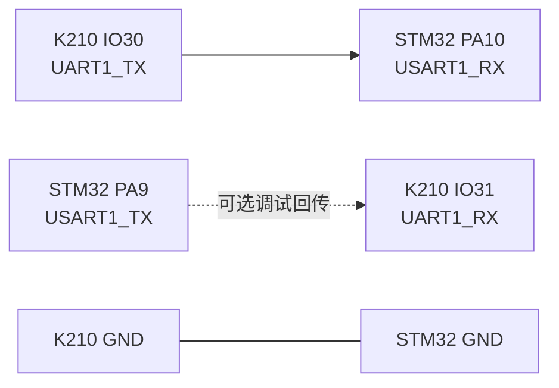

# 硬件接线说明

## 1. 接线原则

1. K210 与 STM32 必须共地；
2. MCU 串口使用 3.3 V TTL 电平；
3. K210 TX 接 STM32 RX，发送端与接收端交叉连接；
4. 电机必须经过电机驱动模块，不能直接连接 MCU GPIO；
5. 首次调试应架空车轮并使用限流电源。

## 2. K210 与 STM32

K210 脚本通过 FPIOA 将 IO30、IO31 映射到 UART1：

```python
fm.register(30, fm.fpioa.UART1_TX, force=True)
fm.register(31, fm.fpioa.UART1_RX, force=True)
```

STM32 工程使用 USART1：

```c
PA9  -> USART1_TX
PA10 -> USART1_RX
```

因此最小通信接线为：

| 序号 | K210 | STM32F103C8T6 | 是否必接 |
|---|---|---|---|
| 1 | IO30 / UART1_TX | PA10 / USART1_RX | 是 |
| 2 | GND | GND | 是 |
| 3 | IO31 / UART1_RX | PA9 / USART1_TX | 当前功能不需要 |



## 3. 电机驱动

`interface.h` 中定义了四路电机方向控制信号：

| STM32 引脚 | 软件名称 | 用途 |
|---|---|---|
| PA7 | `LEFT_F_PIN` | 左电机方向输入 1 |
| PA6 | `LEFT_Z_PIN` | 左电机方向输入 2 |
| PB1 | `RIGHT_F_PIN` | 右电机方向输入 1 |
| PB0 | `RIGHT_Z_PIN` | 右电机方向输入 2 |

连接时应将以上四路 GPIO 接到双路 H 桥电机驱动器的四个逻辑输入端。不同驱动板的命名可能是 `AIN1/AIN2/BIN1/BIN2`、`IN1/IN2/IN3/IN4` 等，请按驱动板真值表对应。

| 软件动作 | 左侧两输入 | 右侧两输入 |
|---|---|---|
| 前进 | SET / RESET | SET / RESET |
| 后退 | RESET / SET | RESET / SET |
| 停止 | RESET / RESET | RESET / RESET |
| 刹车 | SET / SET | SET / SET |

实际工程为了适配左右电机镜像安装，整车前进时左右轮的符号可能相反。若整车动作与预期相反，应优先交换对应电机的两根输出线，或统一修改方向宏，避免零散改动控制算法。

## 4. OLED

OLED 使用软件 I²C：

| STM32 引脚 | OLED |
|---|---|
| PB7 | SCL |
| PB6 | SDA |
| 3.3 V 或模块规定电压 | VCC |
| GND | GND |

供电电压必须以具体 OLED 模块规格为准。

## 5. 工程内其他底盘接口

这些模块不是声源追踪最小系统的必需项，但源码中已保留：

| 模块 | STM32 引脚 | 备注 |
|---|---|---|
| 左循迹 | PA1 | 数字输入 |
| 右循迹 | PA0 | 数字输入 |
| 左避障 | PB14 | 数字输入 |
| 右避障 | PB15 | 数字输入 |
| 速度码盘 | PC13 | 数字输入 |
| 超声波 Echo | PB9 | 外部中断输入 |
| 超声波 Trig | PB8 | 输出，代码中做了逻辑反相 |
| 舵机 | PB5 | 软件脉宽输出 |
| 蜂鸣器 | PA12 | 输出 |
| 红外遥控接收 | PB12 | 外部中断输入 |
| 电池电压采样 | ADC1 通道 4 | 通常对应 PA4，须核对板级电路 |

## 6. 上电检查清单

- [ ] STM32 与 K210 已共地；
- [ ] K210 IO30 接到 STM32 PA10，而不是 PA9；
- [ ] 串口两端均为 9600、8N1；
- [ ] 电机由驱动板和独立合适电源供电；
- [ ] 电机驱动逻辑地与 MCU 地相连；
- [ ] OLED 的供电与 I²C 引脚正确；
- [ ] 车轮已架空；
- [ ] 无短路、反接或超出模块额定电压的情况。
